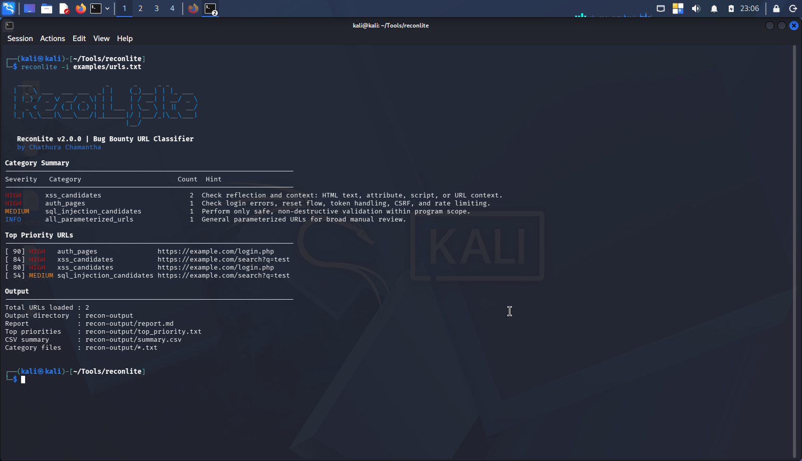

## ReconLite Bug Bounty Tool

ReconLite is a modular reconnaissance toolkit designed to automate the early stages of bug bounty hunting and web application security assessments. It combines multiple open-source reconnaissance tools into a simple workflow, helping security researchers quickly identify live assets, discover endpoints, analyze JavaScript files, and collect parameters for further security testing.

## Features

- Automated subdomain enumeration
- HTTP service probing and technology fingerprinting
- Web crawling and endpoint discovery
- JavaScript file extraction and analysis
- URL parameter harvesting
- Organized output for efficient manual testing
- Modular workflow for easy customization

## Technologies

- Bash
- httpx
- Katana
- curl
- jq
- grep
- awk
- sed

## Intended Use

ReconLite is intended for authorized security assessments, bug bounty programs, and learning web application reconnaissance techniques.

## 📸 Demo

